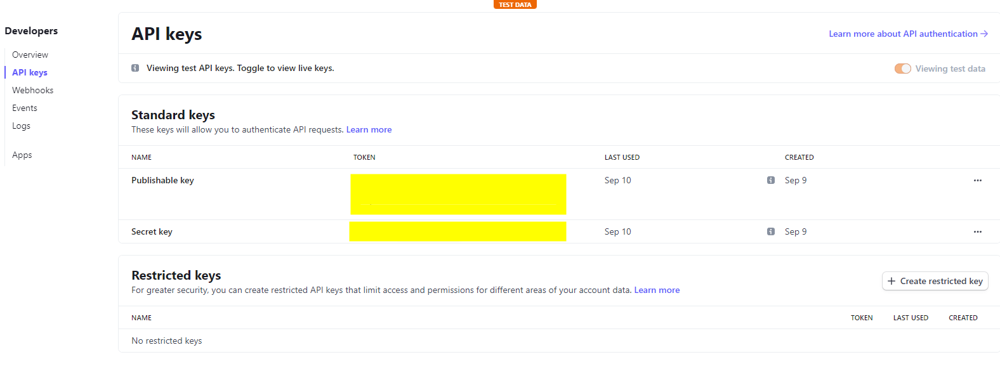
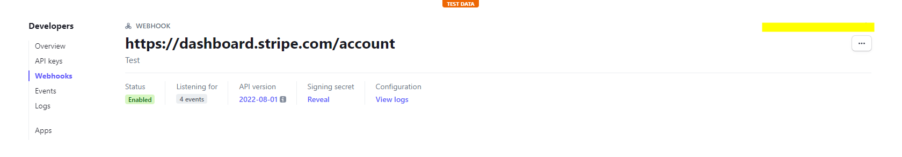
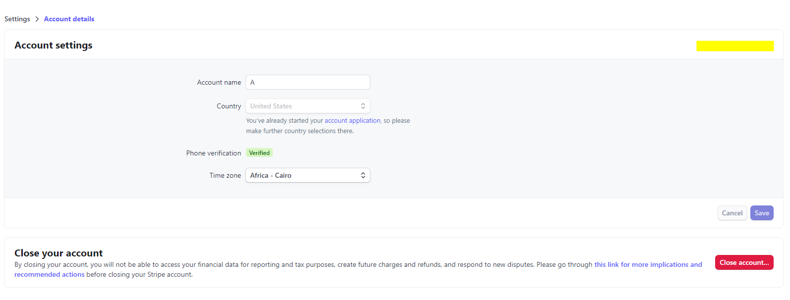
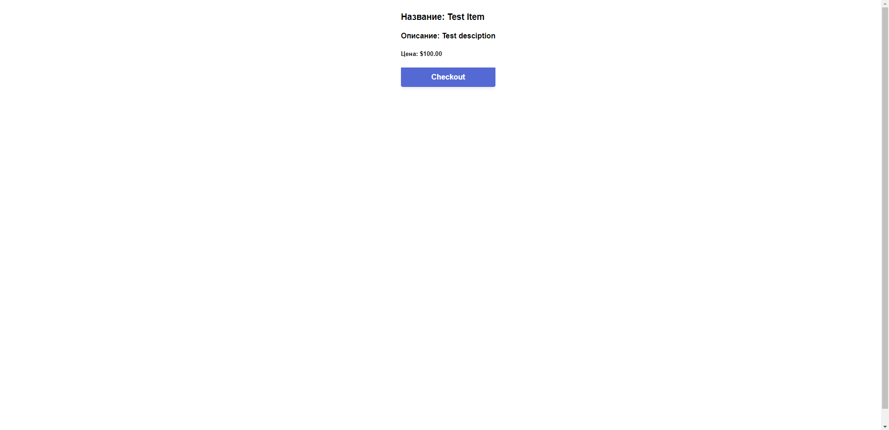
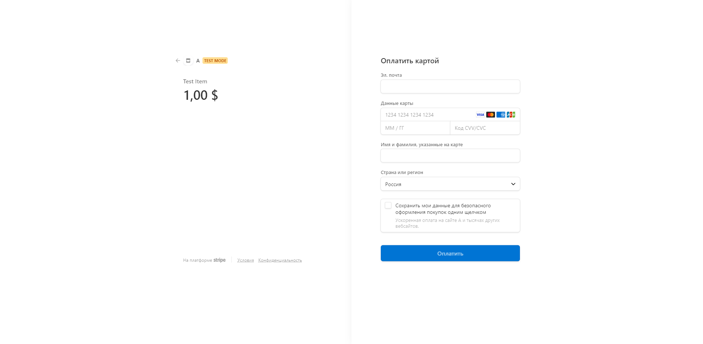

Задание:
-------

* Реализовать Django + Stripe API бэкенд со следующим функционалом и условиями:
* Django Модель `Item` с полями `(name, description, price) `
* API с двумя методами:
    * GET `/buy/{id}`, c помощью которого можно получить Stripe Session Id для оплаты выбранного Item. При выполнении
      этого метода c бэкенда с помощью python библиотеки stripe должен выполняться
      запрос` stripe.checkout.Session.create(...)` и полученный session.id выдаваться в результате запроса
    * GET `/item/{id}`, c помощью которого можно получить простейшую HTML страницу, на которой будет информация о
      выбранном `Item` и кнопка Buy. По нажатию на кнопку Buy должен происходить запрос на `/buy/{id}`, получение
      session_id и далее с помощью JS библиотеки Stripe происходить редирект на Checkout
      форму `stripe.redirectToCheckout(sessionId=session_id)`

* Залить решение на Github, описать запуск в README.md

* Запуск используя `Docker`

* Просмотр Django Моделей в Django Admin панели - __доступно по адресу `127.0.0.1:8000/admin`

* Запуск приложения на удаленном сервере, доступном для тестирования - запущенно на `127.0.0.1:8000`

Получение всех api ключей
-------------------------

Publishable key:
https://dashboard.stripe.com/apikeys

Secret key:
https://dashboard.stripe.com/apikeys

Webhooks:
https://dashboard.stripe.com/webhooks

### Ваши ключи:


### Пример ссылки для Webhooks:


### Для корректной работы нужно активировать приложение:
https://dashboard.stripe.com/settings/account

### Пример приложения:


Запуск
------

```
git clone https://github.com/vadushkin/stripe_task.git
cd stripe_task
python -m venv venv
.\venv\Scripts\activate
pip install -r requirements.txt
python manage.py migrate
python manage.py runserver
```

#### Для админки:
```
python manage.py createsuperuser
```

Запуск Docker
------

```
git clone https://github.com/vadushkin/stripe_task.git
cd stripe_task
docker-compose up -d
```

#### Остановка docker:
```
docker-compose stop
```

Главная страница: http://localhost:8000/

Если сервер не отдаёт информацию, подождите пару секунд и перезагрузите страницу

Сервис
------

* `/` - Ваши товары в виде ссылки на item
* `admin/` - Админка
* `buy/<item_id>` - Купить товар
* `item/<item_id>` - Страница товара

Скриншоты
---------

#### Главная страница с ссылками на товары:


#### Товар и ссылка на оплату:



#### Оплата товара:


